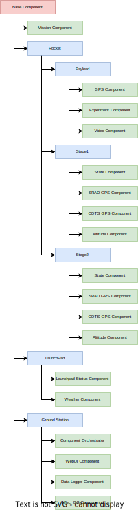

# Helios Architecture
  
This document serves as the high-level and mid-level architecture documentation for Helios. For more information on the low-level architecture, see the [DEVELOPMENT.md](DEVELOPMENT.md) file.

> WARNING: This document is WIP as the Helios proof-of-concept is still being developed! 

## Table of Contents
- [Helios Architecture](#helios-architecture)
  - [Table of Contents](#table-of-contents)
  - [Components](#components)
  - [Events](#events)
  - [Event Lifecycle](#event-lifecycle)
  - [Component Tree](#component-tree)
  - [Webserver](#webserver)
  - [Subsystems \& Orchestrators](#subsystems--orchestrators)
      - [Threading Orchestrator](#threading-orchestrator)
      - [Process Orchestrator](#process-orchestrator)
      - [Interpreter Orchestrator](#interpreter-orchestrator)
      - [Docker Orchestrator](#docker-orchestrator)
  - [Profiles](#profiles)

## Components
The figure at the top of the page shows the high-level architecture of Helios and how the different components and sub-components interact to form the greater ground support system. Components, shown as white rectangles in the diagram, represent the individual processes that makeup Helios. Each component is a microservice responsible for a single task, such as processing rocket data, managing & processing sensor telemetry, generating data from OpenRocket simulations, logging data to a database, or displaying data to a UI dashboard. 

<b>The overall architecture design of Helios is that each component is responsible for its individual task</b>. Producers (i.e. rocket data parsers, sensors, etc.) are oblivious to the existence of consumers, and consumers (logging systems, UI dashboards, etc.) are oblivious to the existence of producers. This is the fundamental core behind Helios' event-driven architecture. Quoting from the [Wikipedia article on Event-Driven Architecture](https://en.wikipedia.org/wiki/Event-driven_architecture):

```
An Event Emitter does not know the consumers of the event; it does not even know if a consumer exists, and in case it exists, it does not know how the event is used or further processed. Sinks have the responsibility of applying a reaction as soon as an event is presented. The reaction might or might not be completely provided by the sink itself. For instance, the sink might just have the responsibility to filter, transform and forward the event to another component or it might provide a self-contained reaction to such an event.
```

This allows for components to be easily swapped out for other components as long as the new component emits or consumes the same events as the old component. This level of modularity is what makes Helios so powerful. For example, if the team develops a new rocket communication protocol, the only component that needs to be changed is the rocket parser component. The rest of the system will continue to work as expected.

These components run as separate processes on the host system (with goals in the future to run each component as a separate container in a larger container orchestration system like docker/Kubernetes) to allow for fault-tolerant operation. The failure of an individual component or sensor will not impact the operations of other components, thereby ensuring Helios keeps running even in the event of a failure.

For more information on the individual components, see the [COMPONENTS.md](COMPONENTS.md) file.

## Events

  

The components interact and talk to other components through "Events Messages", bundles of data in a standardized schema that any component can either emit or receive. These "Event messages" set the global "Event" state of the system, which any component can read or write (through event messages).

      

As such, any component can either be a "producer" (also known as "emitter" or "publisher") of event messages or a "consumer" of event messages. Event messages are also not unique to one component. Multiple components can emit the same event message, and multiple components can listen for the same event message. 

  

These components communicate through a central event bus (labelled "GroundStation" on the diagram), which is responsible for managing the global state of the events as well as routing event messages to the correct components. The event bus is also responsible for storing events in a database for later retrieval. Communications between the event bus and components are through a serialized pickle format that can be transmitted through any binary communication (Unix Pipes, TCP Sockets, HTTP Websockets).

For more information on the individual events, see the [EVENTS.md](EVENTS.md) file.

## Event Lifecycle
Helios works on either a pull- or push- based system. In a pull-based system, components will request events from the event bus, and the event bus will send the requested events to the component. In a push-based system, components will subscribe to events, and the event bus will send the events to the component as they are emitted.

  

## Component Tree
The component tree represents the higher-level abstraction of how the components represent the different subsystems of the rocket. For example, the root node may be the rocket itself, with the children nodes being the different subsystems of the rocket. The subsystems further break down into the components that comprise the tree.

  

This tree structure allows for individual consumers to either ask/subscribe individual components (such as `base.rocket.stage1.gps`) or entire subsystems at once (such as `base.rocket.stage1` or just `base.rocket`), which provides flexibility in how the data is consumed, and allows for the consumer to choose how much data they want to consume.

## Webserver
Another big change for Helios is the migration to a web-central design. The technical design of this system is still TBD but will likely be similar to Grafana in terms of its data visualisation and presentation. By moving away from a monolithic desktop architecture, Helios allows any client with a web browser to view and modify rocket state. This flexibility allows individual sub-teams to monitor and control their independent components. The web-based approach will also enable clients worldwide to remote in and view live telemetry from the pad.


## Subsystems & Orchestrators
The orchestrator is responsible for managing the health and status of the components themselves. It is responsible for starting, stopping, and restarting components as needed and managing recovery in case of a failure or fault. The orchestrator is also responsible for setting up the configuration of the components during start-up and how they interact and talk with each other.


The design of the orchestrator is that it is entirely independent of the components themselves. The functionality of the ground station should be agnostic to the orchestrator, and the orchestrator should be agnostic to the functionality of the ground station. This modularity allows for the orchestrator to be easily swapped out for other orchestrators. Below are the types of orchestrators that are currently planned for Helios:

#### Threading Orchestrator
Uses the python `threading` module to manage and run the individual components. <b>This orchestrator used for development and testing.</b> This orchestrator is not recommended for production use, as it is not fault tolerant and has minimum support recovery in case of a failure. It also suffers more performance issues due to the [GIL (Global Interpreter Lock)](https://en.wikipedia.org/wiki/Global_interpreter_lock) in python.

#### Process Orchestrator
Uses the python `multiprocessing` module to manage and run the individual components. <b>This orchestrator is currently the recommended one for production use</b>, as it is fault tolerant and supports recovery in case of a failure. The performance of this orchestrator is also better than the threading orchestrator, but does have a longer start time and higher memory usage.

#### Interpreter Orchestrator
<b>[TENTATIVE]</b> This is an experimental orchestrator using the non-existent but soon-to-be `interpreter` module defined as part of [PEP 554 – Multiple Interpreters in the Stdlib](https://peps.python.org/pep-0554/) and [PEP 684 – A Per-Interpreter GIL](https://peps.python.org/pep-0684/). This would be fully experimental and not recommended for production use.

#### Docker Orchestrator
<b>[TENTATIVE]</b> Launches components as separate docker containers. Once implemented, this would be the recommended orchestrator for production use.

## Profiles


Profiles define the configuration of a mission. They define how the components are connected, and how they are initialized. Profiles allow the reuse of multiple configurations and multiple components for different missions. For example, a profile for a sounding rocket mission would have a different configuration than a profile for a satellite mission, yet reuse the same GPS or Logging components.

For more information on the individual events, see the [PROFILES.md](PROFILES.md) file.

<!--  -->
Built with a  modular, event-driven, and microservice-based architecture, 
